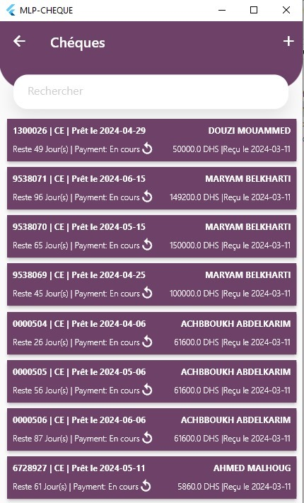
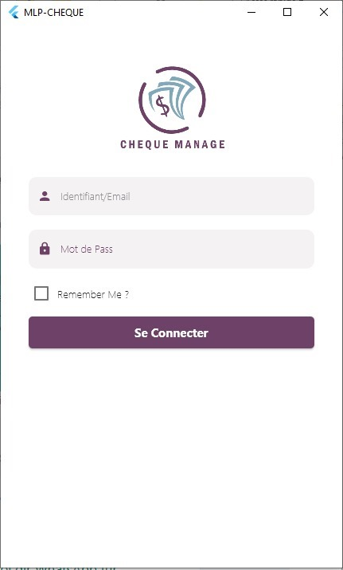
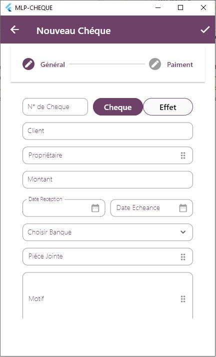
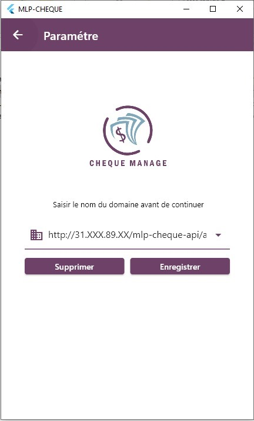
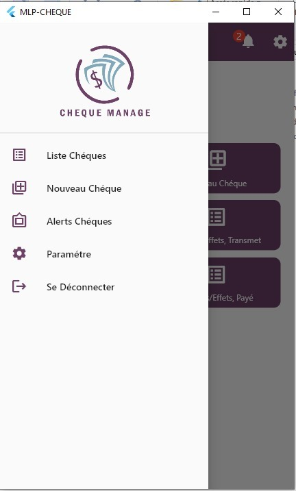

Electronics Store Cheque Management App
This mobile application is customized for an electronics store that allows customers to make payments using cheques. The app is designed to help employees manage cheques efficiently and keep track of their status.

Features:
Login: Employees need to log in to the app using their credentials and input the store domain.

Add Cheques: Employees can add new cheques into the system.

Modify Cheques: Employees can update cheque details if necessary.

Track Cheques Status: Employees can view the status of each cheque (whether it’s paid or not).

This app is built to streamline the cheque management process in a retail environment, allowing employees to quickly and easily track payments and ensure smooth business operations.

